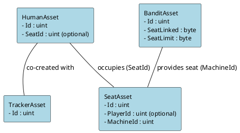

# CasinoJam

CasinoJam is a casino game built on top of the SAGE Game Framework. It leverages asset-based state transitions to model all game entities—such as players, slot machines, seats, and trackers—allowing for flexible and decentralized game state management.

## Game Overview

In CasinoJam, every game entity is represented as an asset:

- **Player Assets:**  
  - **HumanAsset:** Represents a human player.
  - **TrackerAsset:** Tracks gameplay data for a player.
  
- **Machine Asset:**  
  - **BanditAsset:** Represents a slot machine (commonly referred to as "Bandit"). It includes properties like the number of linked seats and limits.

- **Seat Asset:**  
  Represents a seat that can be reserved by a player. It holds information such as the current occupant (`PlayerId`) and the associated machine (`MachineId`).

## Key Transitions and Mechanics

- **Player Creation:**  
  A player creation transition creates both a HumanAsset and a TrackerAsset for a new player.
  
- **Machine Creation:**  
  A machine creation transition (e.g., creating a BanditAsset) initializes a new slot machine.

- **Deposits & Withdrawals:**  
  Transitions allow players to deposit funds into their asset accounts or withdraw winnings.

- **Gamble:**  
  The gamble transition simulates a slot-machine spin. It uses utility functions to generate random spin outcomes, pack slot results into a compact format, and compute rewards based on multipliers and token types.

- **Seat Reservations, Release, and Kick:**  
  - **Reserve:** A player may reserve a seat (SeatAsset), linking their HumanAsset via a `SeatId`.
  - **Release:** Allows a player to cancel their reservation, resetting the linkage and refunding any reservation fee.
  - **Kick:** If a reservation expires or falls outside a grace period, another player can kick the occupant to claim the reservation fee.

## Asset Relationship Overview

The core assets in CasinoJam are interconnected as follows:

- **HumanAsset & TrackerAsset:**  
  Created together when a player joins the game.
  
- **HumanAsset & SeatAsset:**  
  A HumanAsset may reserve a SeatAsset. The HumanAsset’s `SeatId` indicates which seat the player occupies, while the SeatAsset’s `PlayerId` holds the ID of the occupying HumanAsset.

- **BanditAsset & SeatAsset:**  
  A SeatAsset is linked to a BanditAsset via its `MachineId`. The BanditAsset controls how many seats it can have (using `SeatLinked` and `SeatLimit`).

### Visual Diagram of Asset Relationships

Below is a PlantUML diagram that visually represents these relationships:



## Testing and Game Flow

CasinoJam comes with a comprehensive suite of tests covering:
- **Player and Machine creation**
- **Deposits and withdrawals**
- **Gamble transitions with varying multipliers**
- **Seat reservation, release, and kick operations**

These tests simulate full game scenarios, ensuring that all transitions update asset states and balances correctly.

## Getting Started

### Prerequisites

- [.NET 6 SDK](https://dotnet.microsoft.com/download) (or higher)
- A compatible IDE (e.g., Visual Studio, VS Code, Rider)

### Installation

Clone the repository:

```bash
git clone https://github.com/yourusername/CasinoJam.git
cd CasinoJam
```

Restore the packages:

```bash
dotnet restore
```

### Building and Testing

To build the project, run:

```bash
dotnet build
```

To run the tests:

```bash
dotnet test
```

## Summary

CasinoJam leverages the power and flexibility of the SAGE Game Framework to deliver an innovative, asset-based casino experience. The clear separation between player, machine, and seat assets, along with robust transitions for actions like gambling and seat management, makes CasinoJam an excellent example of modern game state management.

## Contact

For questions or suggestions, please open an issue in the GitHub repository or contact [cedric@ajuna.io](mailto:cedric@ajuna.io).