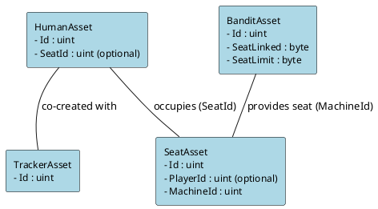

# CasinoJam

CasinoJam is a casino game built on top of the SAGE Game Framework. It leverages asset-based state transitions to model all game entities—such as players, slot machines, seats, and trackers—allowing for flexible and decentralized game state management.

## Game Overview

In CasinoJam, every game entity is represented as an asset:
  
- **Player Assets:**  
  - **HumanAsset:** Represents a human player.
  - **TrackerAsset:** Tracks gameplay data for a player.

- **Machine Asset:**  
  - **BanditAsset:** Represents a slot machine (commonly referred to as "Bandit"). It includes properties like the number of linked seats and limits.

- **Seat Asset:**  
  Represents a seat that can be reserved by a player. It holds information such as the current occupant (`PlayerId`) and the associated machine (`MachineId`).


### Game Flow

´´´´plantuml
@startuml
|User|
start
:Log in / Access account;

:Check if Player Assets exist?;
if (Player assets exist?) then (yes)
  :Proceed;
else (no)
  :Create Player Assets\n(HumanAsset + TrackerAsset);
endif

:Deposit funds into Player Asset;
:Choose a Machine to play on;
|Engine|
if (Machine exists?) then (yes)
  :Select existing Machine (BanditAsset);
else (no)
  :Create Machine (BanditAsset);
endif
|User|

:Rent a Seat on the chosen Machine;
:Reserve Seat (link SeatAsset with HumanAsset);
:Confirm Reservation & pay fee;

:Place a Gamble;
|Engine|
:Execute Slot Machine Spin;
:Calculate Reward based on spins;
:Update balances\n(for Player & Machine);
|User|

:Decide whether to continue playing?;
if (Continue Playing?) then (yes)
  :Place another Gamble;
  -> [loop] repeat gamble steps;
else (no)
  :Release Seat (cancel reservation);
  :Withdraw funds (transfer winnings to account);
endif

stop
@enduml
´´´

## Key Transitions and Mechanics

- **Player Creation:**  
  A player creation transition creates both a HumanAsset and a TrackerAsset for a new player.

- **Machine Creation:**  
  A machine creation transition (e.g., creating a BanditAsset) initializes a new slot machine.

- **Deposits & Withdrawals:**  
  Transitions allow players to deposit funds into their asset accounts or withdraw winnings.

- **Gamble:**  
  The gamble transition simulates a slot-machine spin. It uses utility functions to generate random spin outcomes, pack slot results into a compact format, and compute rewards based on multipliers and token types.

- **Seat Reservations, Release, and Kick:**  
  - **Reserve:** A player may reserve a seat (SeatAsset), linking their HumanAsset via a `SeatId`.
  - **Release:** Allows a player to cancel their reservation, resetting the linkage and refunding any reservation fee.
  - **Kick:** If a reservation expires or falls outside a grace period, another player can kick the occupant to claim the reservation fee.

 ### Sequence Diagram

´´´´plantuml
@startuml
actor User
participant "GameEngine" as Engine
participant "AccountManager" as AccountMgr
participant "AssetManager" as AssetMgr
participant "BalanceManager" as BalanceMgr
participant "BlockchainInfoProvider" as Blockchain

== Login and Initialization ==
User -> Engine: Login / Initiate Transition
Engine -> AccountMgr: Get (or Create) Account for User
AccountMgr --> Engine: Return Account

Engine -> AssetMgr: Check for existing Player Assets
alt No Player Assets Exist
    Engine -> AssetMgr: Create Player Assets\n(HumanAsset + TrackerAsset)
    AssetMgr --> Engine: Return new Assets
end

== Deposit Funds ==
User -> Engine: Request Deposit (e.g., Deposit Transition)
Engine -> BalanceMgr: Process Deposit for Player Asset
BalanceMgr --> Engine: Updated Asset Balance

== Machine Selection ==
User -> Engine: Select Machine for Play
Engine -> AssetMgr: Check for existing Machine (BanditAsset)
alt Machine not found
    Engine -> AssetMgr: Create Machine (BanditAsset)
    AssetMgr --> Engine: Return new Machine
end

== Rent Seat ==
User -> Engine: Rent Seat on Machine (Rent Transition)
Engine -> AssetMgr: Create/Update SeatAsset\n(Link Seat to HumanAsset)
Engine -> BalanceMgr: Process Reservation Fee\n(Withdraw from Human, Deposit to Seat)
BalanceMgr --> Engine: Updated Balances

== Gamble ==
User -> Engine: Place Gamble (Gamble Transition)
Engine -> Blockchain: Get current block number & Random Hash
Engine -> AssetMgr: Execute Gamble Transition\n(Perform Spin, Calculate Reward)
Engine -> BalanceMgr: Transfer Funds\n(Withdraw from Machine, Deposit to Player)
BalanceMgr --> Engine: Updated Balances
Engine --> User: Return updated Assets and Balances

== Release/Withdraw ==
User -> Engine: Request Release Seat or Withdraw Funds
Engine -> AssetMgr: Process Release Seat Transition
Engine -> BalanceMgr: Process Withdrawal Transition
Engine --> User: Return final updated state

@enduml
´´´

## Asset Relationship Overview

The core assets in CasinoJam are interconnected as follows:

- **HumanAsset & TrackerAsset:**  
  Created together when a player joins the game.
  
- **HumanAsset & SeatAsset:**  
  A HumanAsset may reserve a SeatAsset. The HumanAsset’s `SeatId` indicates which seat the player occupies, while the SeatAsset’s `PlayerId` holds the ID of the occupying HumanAsset.

- **BanditAsset & SeatAsset:**  
  A SeatAsset is linked to a BanditAsset via its `MachineId`. The BanditAsset controls how many seats it can have (using `SeatLinked` and `SeatLimit`).

### Visual Diagram of Asset Relationships

Below is a PlantUML diagram that visually represents these relationships:




## Testing and Game Flow

CasinoJam comes with a comprehensive suite of tests covering:
- **Player and Machine creation**
- **Deposits and withdrawals**
- **Gamble transitions with varying multipliers**
- **Seat reservation, release, and kick operations**

These tests simulate full game scenarios, ensuring that all transitions update asset states and balances correctly.

## Simple ASCII Art for CasinoJam

```
4x |
   v
+-------------+--------+ 
¦  7   3   5  | 2   1  ¦ -->       0$  
¦  7   7   7  | 5   5  ¦ -->    1400$  
¦  7   4   6  | 3   2  ¦ -->       0$  
+----------------+-----¦ 
¦ Bonus Spin:  8 |  4x | -->
+----------------+-----¦ 
¦ JACKPOT   1'623'000$ ¦ --> 
+======================+
| PAY.OUT   0'000'000$ | <==   _______
+======================+
```

## Getting Started

### Prerequisites

- [.NET 6 SDK](https://dotnet.microsoft.com/download) (or higher)
- A compatible IDE (e.g., Visual Studio, VS Code, Rider)

### Installation

Clone the repository:

```bash
git clone https://github.com/yourusername/CasinoJam.git
cd CasinoJam
```

Restore the packages:

```bash
dotnet restore
```

### Building and Testing

To build the project, run:

```bash
dotnet build
```

To run the tests:

```bash
dotnet test
```

## Summary

CasinoJam leverages the power and flexibility of the SAGE Game Framework to deliver an innovative, asset-based casino experience. The clear separation between player, machine, and seat assets, along with robust transitions for actions like gambling and seat management, makes CasinoJam an excellent example of modern game state management.

## Contact

For questions or suggestions, please open an issue in the GitHub repository or contact [cedric@ajuna.io](mailto:cedric@ajuna.io).

---

Enjoy exploring the power of asset-based state transitions with CasinoJam!

---

